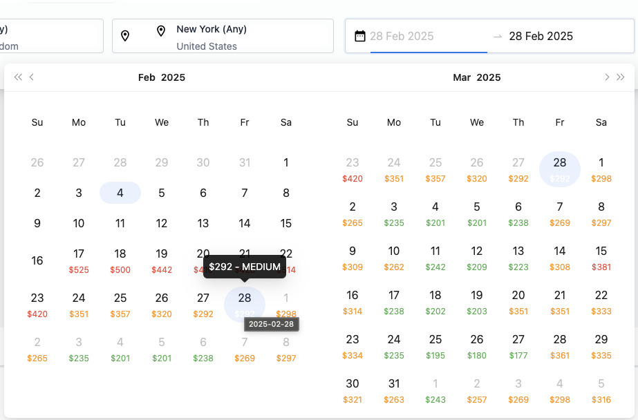

# Flight Search Application

A modern flight search application built with React 19, TypeScript, and Vite. This application allows users to search for flights, compare prices, and view flight details with a responsive and user-friendly interface.

## Features

- Flight search with multiple parameters
- Real-time price calendar
- Multi-language support
- Currency conversion
- Responsive design
- Location-based suggestions
- Advanced filtering options
- Automatic location detection (requires browser permission)

## Price Calendar

The price calendar feature allows users to view flight prices across different dates at a glance, making it easier to find the most cost-effective travel dates.



## Technologies

- React 19
- TypeScript
- Vite
- Ant Design
- TailwindCSS
- Axios
- React-Toastify

## Browser Permissions

This application uses the following browser features that require user permission:

- **Geolocation**: Used to automatically detect user's location for:
  - Setting default currency
  - Suggesting nearby airports
  - Localizing content
  - Setting appropriate market/region

When you first use the application, your browser will prompt for permission to access your location. You can:

- Accept: Get personalized location-based features
- Decline: Use the application with default settings (US market/USD)

To manage location permissions:

- Chrome: Settings > Privacy and Security > Site Settings > Location
- Firefox: Settings > Privacy & Security > Permissions > Location
- Safari: Preferences > Privacy > Location Services

## Prerequisites

- Node.js 18.x or higher
- npm or yarn
- Docker (optional)

## Environment Variables

Create a `.env` file in the root directory with the following variables:

## Installation and Running the Application

### Local Installation

1. Clone the repository:

```shell
git clone https://github.com/yourusername/flight-search-app.git
cd flight-search-app
```

2. Install dependencies:

```shell
npm install
# or
yarn install
```

3. Create a `.env` file in the root directory and add the required environment variables.

4. Start the development server:

```shell
npm run dev
# or
yarn dev
```

### Docker Installation

1. Clone the repository:

```shell
git clone https://github.com/yourusername/flight-search-app.git
cd flight-search-app
```

2. Build the Docker image:

```shell
docker build -t flight-search-app .
```

3. Run the Docker container:

```shell
docker run -p 3000:3000 flight-search-app
```

## Expanding the ESLint configuration

If you are developing a production application, we recommend updating the configuration to enable type aware lint rules:

- Configure the top-level `parserOptions` property like this:

```js
export default tseslint.config({
  languageOptions: {
    // other options...
    parserOptions: {
      project: ['./tsconfig.node.json', './tsconfig.app.json'],
      tsconfigRootDir: import.meta.dirname,
    },
  },
});
```

- Replace `tseslint.configs.recommended` to `tseslint.configs.recommendedTypeChecked` or `tseslint.configs.strictTypeChecked`
- Optionally add `...tseslint.configs.stylisticTypeChecked`
- Install [eslint-plugin-react](https://github.com/jsx-eslint/eslint-plugin-react) and update the config:

```js
// eslint.config.js
import react from 'eslint-plugin-react';

export default tseslint.config({
  // Set the react version
  settings: { react: { version: '18.3' } },
  plugins: {
    // Add the react plugin
    react,
  },
  rules: {
    // other rules...
    // Enable its recommended rules
    ...react.configs.recommended.rules,
    ...react.configs['jsx-runtime'].rules,
  },
});
```
